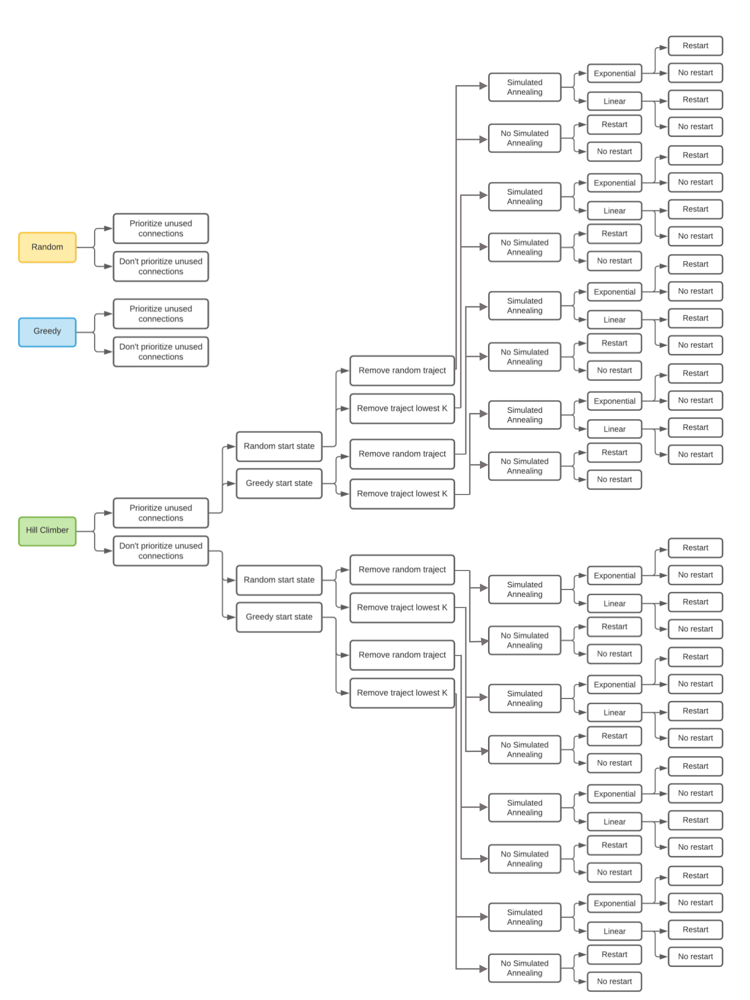

# RailNL
This project is part of the 'Programmeertheorie' course of the programming minor of the University of Amsterdam.

## Description
The organization of a trainnetwork is a very complex problem and can be solved with the help of AI-techniques. The goal of this project is to search for optimal line management solutions for the intercity trainnetwork in the Dutch provinces North- and South-Holland and eventually for The Netherlands. The focus here lays on the trajectories of intercity trains use during the day. This implies that there have to be created a couple of trajectories within a certain timeframe. In this case a trajectory is a route of tracks and stations on which trains can travel back and forth. Eventually the algorithm has to produce the most efficient line management solution as possible.

The former can be done with the help of the following equation:

`K = p * 1000 = (T * 100 + Min)`

`K` = quality of the line management

`p` = fraction of the ridden connections (number between 0 and 1)

`T` = the number of trajectories

`Min` = the number of minutes of all the trajectories taken together

## Assignment
#### North- and South-Holland
For this assignment a line management solution has to be found for North- and South-Holland with max. 7 trajectories within a timeframe of 2 hours, and all connections have to be ridden. After this is done, this has to be done again but with the goal to optimize `K` for it to be as high as possible. In this case not all connections have to be ridden. For North- and South-Holland there are 28 connections and 22 stations.

#### The Netherlands
The assignment is the same for The Netherlands, whereas the only difference is that the line management solution may have 20 trajectories max. in a timeframe of 3 hours. Also not all connections have to be ridden and `K` has to be optimalized. For The Netherlands there are 89 connections and 61 stations.

### State space 
The state space of a problem contains all the possible solutions ("states") that are possible, even when they're not valid solutions according to the implemented heuristics. In a line management solution, the order of the trajectories is not important but the repetition of trajectories is not allowed. This leads to the following formula for calcualting the state space:

`n!/(r!(n-r)!)`

Here `n` is the number of unique trajectories shorter than 120 minutes and `r` is the max. number of trajectories. In the North- and South-Holland case `r` = 7 and `n` = 10835519. The entire state space is thus equal to 10835519 * 10835518 * 10835517 * 10835516 * 10835515 * 10835514 * 10835513 = 10^10^8.16.

### Algorithms
#### Constraints
To narrow down the problem and make the solution more realistic to real-life line management, there have been added a few general constraints:

* A trajectory cannot contain the same connection or station twice or more times.
* No teleportation can take place; there has to be continued from the previous destination of the trajectory.
* All stations have to be included in a line management solution, only then a line management solution is valid.
* A new connection is first being chosen from connections that are not yet represented in the line management solution. If this is not possible, overlap in connections is allowed.
* The start station of a trajectory is being chosen from a list of start stations with only one connection. If these are all used, a random start station is being chosen.

#### Randomise
This algorithm picks a random beginning station and randomly picks a connection to go to the next station. It keeps adding connections to the trajectory as long as it remains within the constraints. It also starts a new trajectory if all connections from a station have already been ridden or if the only unused connection left leads to a station that has already been visited. For this algorithm there is an option of finding just one valid solution (with all connections ridden) or do multiple iterations to find a solution with the highest K for this sample (not all connections have to be ridden). Another option is to prioritize unused connections while making trajectories.

#### Greedy
This algorithm is build the same as Randomise, with the exception that it always picks the shortest connection when making a trajectory. It also standardly uses iterations to find a solution with the highest K of the sample.

#### Hill Climber
Hill Climber starts with a valid start state, which is a line management solution from either Randomise or Greedy with user specified iterations. The algorithm then tries to find a more optimal K value by removing a trajectory and replacing it with a new one, again with a user specified number of iterations. There is an option to randomly remove a trajectory or remove the trajectory with the lowest partial K. To calculate the latter, `T` is initialized as 1

#### Simulated Annealing
Simulated Annealing is an extension of the Hill Climber algorithm. With every new state it calculates an acceptance probability with the help of a so called 'temperature' formula which can be linear or exponential. In this situation, states with lower K scores can also be accepted. This way, you can get out of a local optimum the Hill Climber algorithm might have gotten into.

## Structure of the repository
* The program can be run with main.py and in output.csv the results are shown.
* code filemap: files for the classes, algorithms, calculation of the state space and the visualisation can be found.
* data filemap: csv files containing connection and station data for North- and South-Holland and The Netherlands.
* docs filemap: images of maps and visualisations of solutions.
* plots: analysis of some algorithms.
* results: line management solution maps of all algorithms, including the output in csv files.

## Getting started
### Prerequisits
This program is fully written in [Python (3.8.10)](https://www.python.org/downloads/) and to run the code you will need some dependencies that can be installed with the follwoing line of code:

`pip install -r requirements.txt`

### Testing
The algorithms can be run with `python main.py`. This file will ask for user input in which you can specify which algorithm you want to run and you can specify parameters dependent on which algorithm you're choosing.
The maps and data of line management solutions will be saved in /results/[algorithm]/[Holland/National] and the (statistical) results will be saved to /plots.

The following diagram displays all the options and combinations that can be run:

## Authors
* [Seda den Boer](https://www.github.com/sedadenboer)
* [Eva Pots](https://github.com/evapots)
* [Thijmen Cornelis](https://github.com/Thijmen1411)
